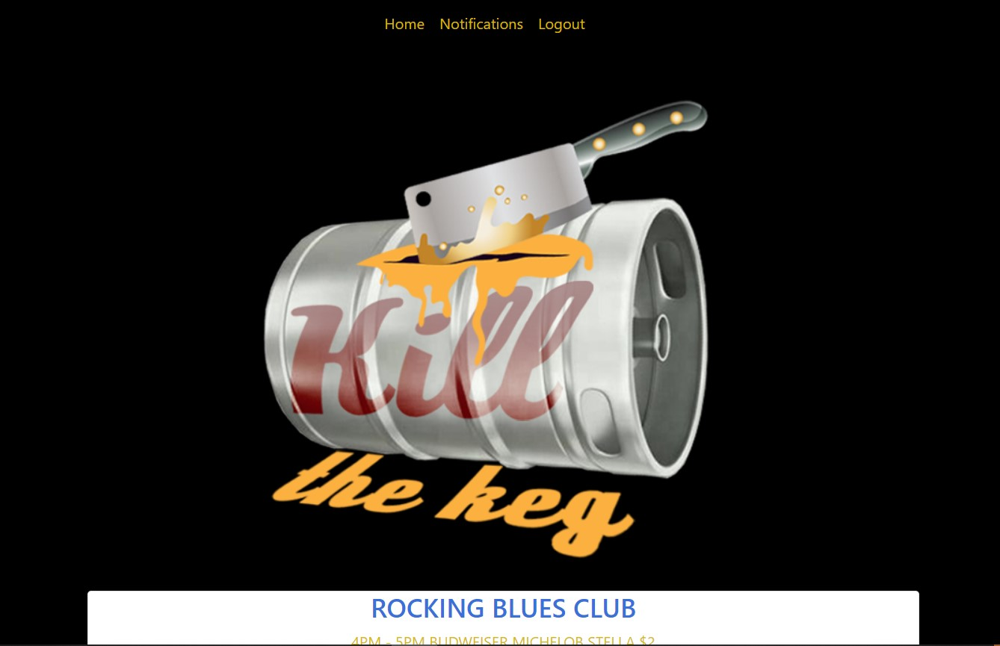

# Kill the Keg

## Mission
Helping bar owners to quickly deplete kegs from leftover product, while helping avid beer drinkers find less expensive ways to drink with friends.

## Future Features
Provide events grouped by dates with the dates as headers.

## Webpage (Heroku Deployment)
https://obscure-eyrie-90813.herokuapp.com/

## Contributors
- Josh Carter
- Chris Southwick
- Rebecca Beall
- Gil Abadio

## Technologies & Tools Used
- Heroku
- Bootstrap
- TributeJS
- Sequelize
- Express
- NODE
- Session
- Handlebars
- MySQL
- Authentication
- Environment variable
- RestfulAPI
- GitHub
- Photoshop
